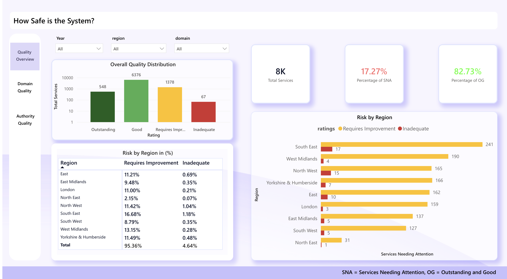
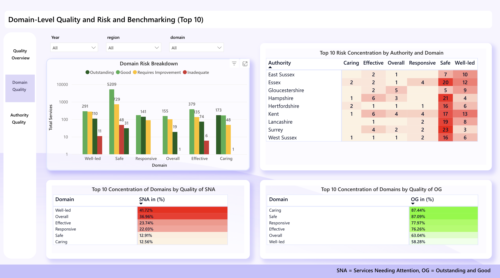
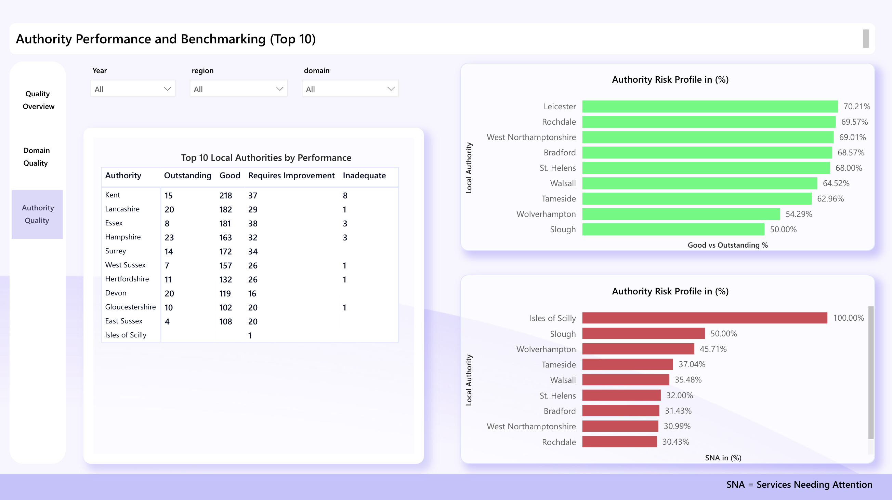

# Care Quality Commission – Care Quality & Risk Analytics

## Overview

This project uses publicly available **Care Quality Commission (CQC)** inspection and ratings data to explore the quality of care services across England.

The aim of the project was to show how inspection data can be used to understand service quality, identify areas that may need attention, compare performance across locations, and support better decision-making.

I used **Python** for the initial data collection and cleaning, then used **Power Query in Power BI** for further transformation and merging of the datasets before building the final interactive reports.

## Data Source and Scope

The project uses publicly available datasets from the **Care Quality Commission of England**, focusing on care service directories and inspection ratings.

The main fields used in the analysis include:

- Overall ratings
- Service type
- Inspection domains
- Region
- Local authority
- Publication dates

The CQC datasets were used because they provide structured information on the quality and performance of care services and are useful for demonstrating how inspection data can support risk monitoring and service improvement.

## Data Preparation

The data preparation process was carried out in two stages.

### Python

Python was used to:

- Collect and load the datasets.
- Remove duplicate records.
- Remove inactive services.
- Remove services without ratings.
- Check and clean inconsistent records.
- Keep the required fields for analysis.
- Save the cleaned datasets as CSV files.

### Power Query

After the initial cleaning in Python, Power Query was used in Power BI to:

- Carry out further data cleaning.
- Standardise fields across the datasets.
- Check data types and consistency.
- Merge the directory and ratings datasets.
- Prepare the final dataset for analysis and reporting.

The aim was to keep a consistent and reliable dataset for the final reports.

## Dashboard 1 – Overall Quality and Risk by Region

The first report gives an overall view of how care services are performing.

The dashboard shows the distribution of services across the four main rating categories:

- Outstanding
- Good
- Requires Improvement
- Inadequate

The analysis showed that:

- **548 services** were rated Outstanding.
- **6,376 services** were rated Good.
- **1,378 services** were rated Requires Improvement.
- **67 services** were rated Inadequate.
- Around **82.73%** of services were rated Outstanding or Good.
- Around **17.27%** of services were rated Requires Improvement or Inadequate.

The report also compares risk across regions.

The **South East** had the highest number of services requiring attention, with:

- **241 services** rated Requires Improvement.
- **17 services** rated Inadequate.

The regional percentage table also showed that the South East had approximately:

- **16.68%** of services rated Requires Improvement.
- **1.18%** rated Inadequate.

This report helps show where lower-performing services are more concentrated.

## Dashboard 2 – Domain-Level Quality and Risk

The second report looks at performance across individual inspection domains.

The domains analysed include:

- Caring
- Effective
- Overall
- Responsive
- Safe
- Well-led

The dashboard shows how services were rated within each domain and also compares performance across local authorities.

One of the main findings was that:

- **5,209 services** were rated Good in the Safe domain.
- Only **6 services** were rated Inadequate in the Effective domain.

The report also includes a matrix showing the top local authorities with higher concentrations of risk across different domains.

Another part of the report compares the percentage of services needing attention with those rated Outstanding or Good.

For services needing attention, the highest concentrations were:

- Well-led – **41.72%**
- Overall – **36.96%**
- Effective – **23.74%**
- Responsive – **22.03%**
- Safe – **12.91%**
- Caring – **12.56%**

For services rated Outstanding or Good, the strongest areas were:

- Caring – **87.44%**
- Safe – **87.09%**
- Responsive – **77.97%**
- Effective – **76.26%**
- Overall – **63.04%**
- Well-led – **58.28%**

This shows that performance can vary significantly depending on the inspection domain.

## Dashboard 3 – Local Authority Performance

The third report compares the performance of local authorities.

The dashboard includes the top-performing authorities as well as authorities with a higher proportion of services needing attention.

Some of the authorities with strong performance included:

- Kent
- Lancashire
- Essex
- Hampshire
- Surrey
- West Sussex
- Hertfordshire
- Devon
- Gloucestershire
- East Sussex

The report also compares the proportion of services rated Outstanding or Good with those rated Requires Improvement or Inadequate.

The authority risk profile shows that some local authorities had a much higher proportion of services needing attention than others.

For example:

- Isles of Scilly – **100%**
- Slough – **50%**
- Wolverhampton – **45.71%**
- Tameside – **37.04%**
- Walsall – **35.48%**

The report helps make it easier to compare local authorities and identify where closer attention may be required.

## Key Findings

The analysis showed that:

- Most care services were rated **Good or Outstanding**.
- A smaller proportion of services were rated **Requires Improvement or Inadequate**.
- Risk was concentrated in a smaller group of services and locations.
- Quality patterns varied across regions, local authorities and inspection domains.
- Some domains performed better than others.
- Some local authorities had noticeably higher proportions of services needing attention.

## Why Inspection Data Matters

Inspection data can be useful for understanding how care services are performing and where problems may be developing.

It can help to:

- Identify potential risks earlier.
- Compare service quality across locations.
- Highlight areas that may need additional inspection or support.
- Support fairer allocation of resources.
- Improve transparency.
- Support evidence-based decision-making.

The purpose of the project is not only to show ratings, but to demonstrate how inspection data can be turned into useful information for understanding care quality and supporting better outcomes for people who use care services.

## Tools Used

- **Python**
- **Pandas**
- **Power BI**
- **Power Query**
- **DAX**
- **CSV**
- **Data Cleaning**
- **Data Transformation**
- **Data Visualisation**
- **Exploratory Data Analysis**

## Dashboard Preview

### Overall Quality and Risk by Region

### Domain-Level Quality and Risk

### Local Authority Performance

## Live Dashboard

[**View the interactive Power BI dashboard**](https://app.powerbi.com/view?r=eyJrIjoiMDliNWE5ZmEtNTQ0NC00MmEwLTgxYzUtNzA3ZDM0ZDI4NDI3IiwidCI6ImYyMDIxN2JmLWEwYzYtNDZlNi1hMTdmLTY3YzkwNTY0NDgwZiJ9)

## Key Takeaway

Most services in the dataset were performing well, but the analysis also showed that quality and risk were not evenly distributed.

Looking at ratings by region, local authority and inspection domain makes it easier to identify where problems are concentrated rather than relying only on the overall national picture.

Good quality data supports better decisions, and inspection data can play an important role in improving transparency, identifying risk and supporting better outcomes in care services.

## License

This project is licensed under the **MIT License**.

You are free to use, modify and distribute the code and materials in this repository, provided the original copyright and license notice are included.

See the full license here:

[LICENSE](LICENSE.txt)

---
